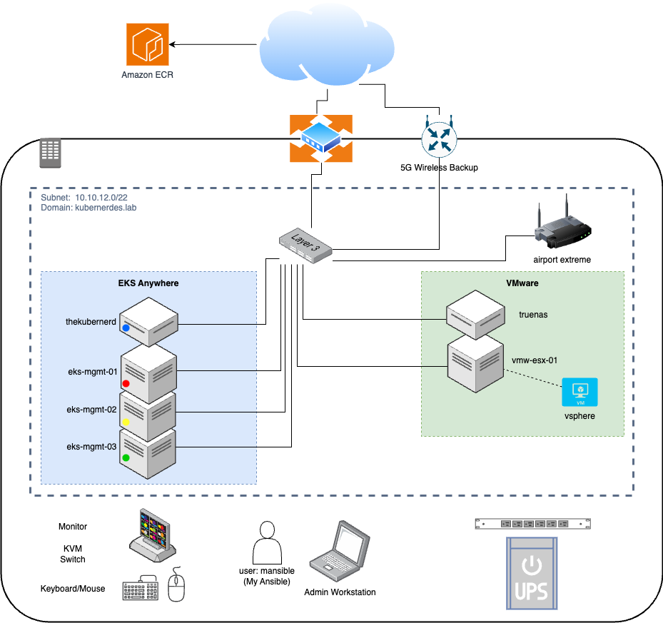

# kubernerdes.lab
Lab environment consisting of Amazon EKS Anywhere and VMware vSphere for hosting containers and VMs


## Purpose 
This repository will provide an opinionated deployment to create an environemnt to run containers and virtual machines on commodity hardware using Open Source Software where possible.  In general, this approach will rely on the standard implementation guidance and focus on the integration of all the different technologies.

| Project/Software Homepage | Description |
|:-----------------|:-------------|
| [EKS-Anywhere](https://anywhere.eks.amazonaws.com/) | Amazon EKS Anywhere is container management software built by AWS that makes it easier to run and manage Kubernetes on-premises and at the edge. |
| [Emissary](https://www.getambassador.io/docs/emissary/latest/tutorials/getting-started) | Emissary-Ingress is the most popular API Gateway Kubernetes-native - open-source, that delivers the scalability, flexibility, and simplicity for some of the world's largest Kubernetes installations. Emissary-Ingress is an open source CNCF incubating project, and it uses the ubiquitous Envoy Proxy at its core. |
| [MetalLB](https://metallb.universe.tf/) | MetalLB is a load-balancer implementation for bare metal Kubernetes clusters, using standard routing protocols. |
| [Cilium (OSS)](https://cilium.io/) | Cilium is a networking, observability, and security solution with an eBPF-based dataplane. <BR> (from [Isovalent - a Cisco Company)](https://isovalent.com/) |
| [Hubble](https://github.com/cilium/hubble) | Hubble is a fully distributed networking and security observability platform for cloud native workloads. |
| [Prometheus](https://prometheus.io/) | From metrics to insight - Power your metrics and alerting with the leading open-source monitoring solution. |
| [Grafana](https://github.com/grafana/grafana) | The open and composable observability and data visualization platform. |
| [VMware](https://www.vmware.com/) | Virtualization platform |
| [Kubevirt](https://kubevirt.io/) | KubeVirt technology addresses the needs of development teams that have adopted or want to adopt Kubernetes but possess existing Virtual Machine-based workloads that cannot be easily containerized. |
| [Containerized  Data Importer](https://github.com/kubevirt/containerized-data-importer/) | About: Data Import Service for kubernetes, designed with kubevirt in mind. |


## Overview
This implementation pattern represents an "edge deployment" facilitating a hybrid cloud architecture.  This will enabling you to run containers and virtual machines on gear that requires lower resources (space, power, cooling, etc...) in an enclave capable of being independent of external resources.



## Getting Started

Firstly, you should grab the example "ENV.vars" file and update it with your own values (or continue using the user/repo from this repo

replace <GIT_OWNER> with the Git Owner where the repo is being stored, then run the following:
```
git clone https://github.com/<GIT_OWNER>/kubernerdes.lab.git
cd kubernerdes.lab
vi Files/ENV.vars
. ./Files/ENV.vars
cd Scripts
```

I have created the scripts using the old Init Script notation of numerically numbered files.  You can decided which ones you would like to run, or not.


## References and Notes
| [Containerized  Data Importer - VDDK How To](https://github.com/kubevirt/containerized-data-importer/blob/main/doc/datavolumes.md#vddk-data-volume) | Details regarding the process to transfer Data Volumes between platforms |
